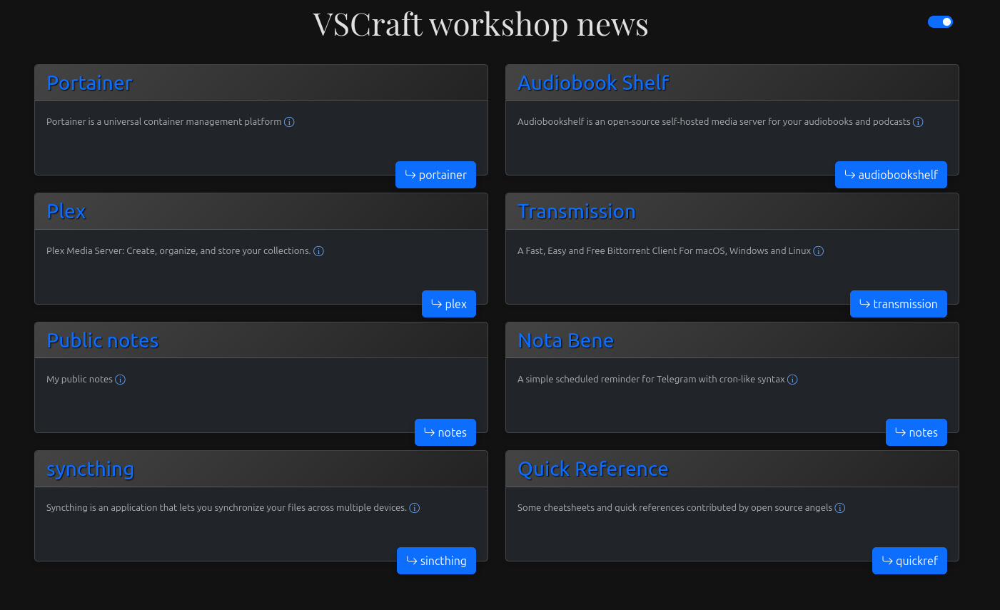

# local_site

Корневая страница на моем веб-сервере в локальной сети.
При коммите атоматически формируется из описания страницы `site.json` и шаблона `index.tpl` 

Репозиторий создан для эксплуатации возможности автоматически экспортировать содержимое в каталог вебсервера [при пуше в специальный origin](https://vsuh.github.io/vpub/OBSIDIAN/notes/%D0%90%D0%B2%D1%82%D0%BE%D0%BC%D0%B0%D1%82%D0%B8%D1%87%D0%B5%D1%81%D0%BA%D0%BE%D0%B5%20%D0%BE%D0%B1%D0%BD%D0%BE%D0%B2%D0%BB%D0%B5%D0%BD%D0%B8%D0%B5%20%D1%81%D0%BE%D0%B4%D0%B5%D1%80%D0%B6%D0%B8%D0%BC%D0%BE%D0%B3%D0%BE%20%D1%81%D0%B0%D0%B9%D1%82%D0%B0%20%D0%BF%D1%80%D0%B8%20%D0%BF%D1%83%D1%88%D0%B5%20%D0%B2%20github.com.html).

Для автоматической генерации файла `index.html` при коммите, нужно выполнить команду:

```bash
git config --local core.hooksPath .githooks
chmod +x /githooks/pre-commit
```

Результат выглядит так:


